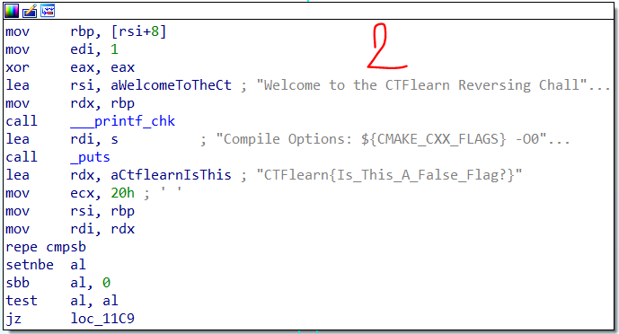

# CTF/Re

## [Reykjavik](https://ctflearn.com/challenge/990)

## Lời giải

- Sau khi chúng ta tải file về và tiến hành giải nén ra thì chúng ta thử chạy file thực thi của nó bằng câu lệnh `./Reykjavik` (trước hết chúng ta phải cấp quyền cho nó bằng câu lệnh `chmod +x Reykjavik`, nếu không nó ssex hiện ra câu lệnh như sau `-bash: ./Reykjavik: Is a directory`)

- Ta chạy thử chương trình thì thấy nó hiện `Usage: Reykjavik CTFlearn{flag}`, tức là đầu nào của chúng ta khi chạy chương trình sẽ có dạng `./Reykjavik CTFlearn{flag}`

    

- Ta thử nhập theo đúng cú pháp mà chương trình cho thì sẽ thấy:

    

- Đến đây vẫn chưa có ý tưởng gì thì chúng ta sẽ ném file thực hti đó vào `IDA` để xem chương trình đó gồm những cái gì, và thứ hiện trước mặt chúng ta mà một sơ đồ khối về chương trình trông như thế này:

    

- Ý tưởng đầu tiên của tui khi bắt tay làm là sẽ tìm khối mà nó trả về thành công đã tìm thấy `flag`, xong rừi từ khối đó tui làm ngược từ dưới lên trên, kiểu như thứ tự để chương trình hiện đúng là `input` -> `1` -> `2` -> `3` -> `4` -> `flag`, thì tui sẽ mò đến cái khối thông báo xuất hiện `flag`, dò ngược lại từ từ khối nào mà chúng ta có thể đến được khối đó (trong ví dụ trên là khối 4) rùi tiếp tục lặp lại những thao tác đó đến khi nó trở về khối ban input đầu vào.

- Với bài trên thì chúng ta dễ dàng xác định thứ tự cần đi là như sau:

    

- Chúng ta hãy bắt đầu sử dụng `gdb-peda`, hay `gdb`,... (bất kì cái gì bạn có thể debug) để bắt đầu debug chúng với câu lệnh `gdb --args Reykjavik CTFlearn{flag}`. Khi hạy chương trình có đầu input đầu vào thì ra sử dụng `gdb --args name_file input`. `CTFlearn{flag}` ở đây bạn có thể truyền bất kì kí tự nào bạn muốn không nhất thiết phải theo như thế kia, nhưng mà chỉ có một input để trả về giá trị thành công. 

- Trong khi sử dụng `gdb-peda` mà bạn muốn thay đổi input đầu vào thì chúng ta có thể sử dụng câu lệnh `r input`, chứ không cần thoát ra rùi lại sử dụng `gdb --args`. 

- Ta quan những khối mà sẽ nhảy đến flag (4 khối lần lượt là)

    

    

    

    

- Bây giờ tui sẽ chỉ cho các bạn cách đặt `break point` để có thể xem xem với cái input đầu vào của chúng ta thì chương trình chạy có thể đến được với cái khối mà chúng ta cần hay không. Ta thực hiện câu lệnh `disas` trong gdb-peda để xem mã máy, chúng ta sẽ thấy nó tương tự như là những câu lệnh trong khối

    

    

- Vậy ý tưởng đặt `break point` là gì ??

    

    - Ta biết là chúng ta cần chương trình chạy theo thứ tự `1` -> `2` -> `3` -> `4` vậy ta sẽ cố tình đặt những `break point` trong những khối đó và thực hiện chạy chương trình, nếu mà chạy đến khối nào mà nó không đi theo đúng thứ tự `break point` của chúng ta cần thì chúng ta sẽ xem xem là điều gì kiến cho nó không như dự kiến và sẽ cố tình thay đổi input để thoả mãn đi qua từng khối một.

    - Để có thể theo dõi được thì tui sẽ cố tình đặt break point ở những vị trí cuối cùng của từng khối `1`, `2`, `3`, `4`, đó là những dòng 
           
        
        

    - Như khối đầu tiên thì tui sẽ đặt break point tại `cmp edi, 1`, bằng câu lệnh `b * 0x00005555555550ad`

        

    - Cứ tiếp tục đặt những break point trong những khối còn lại và ta sẽ được 4 điểm break point, muốn xem những break point đã đặt thì ta sử dụng câu lệnh `i b` (info breakpoint), muốn xoá hết breakpoint thì sử dụng câu lệnh `delete`,sau khi đặt xong `i b` thì ta sẽ hiện như sau

        

    - Sau đó ta nhấn `run` hay `r` thì chương trình thay vì chạy từng bước một thì nó nhảy một phát đến break point đầu tiên

        

    - Chúng ta nhấn `c` hay `continue` để tiếp tục nhảy đến break point tiếp theo, nếu lỗi thì nos sẽ hiện một thứ gì đó rùi kết thúc chương trình, trong ví dụ trên với input đầu vào là `TungDvan` thì khi đến `break4` và nhảy sang `break5` thì nó kết thúc chương trình lun, vậy tức là trong khối `break4` của tui có vấn đề và chúng ta hãy xem xem là tại sao nó không nhảy được sang `break5`.

        

    - Ta quay lại khối số `3`, là khối mà chúng ta chạy và không thể nhảy sang khối `4`, xem xem trong khối đó có những gì, hình ảnh trên của chúng ta thấy trong thanh `rsi` là `input` của chúng ta, mà tự dưng thanh `rdi` ở dưới có một một chuỗi mà rất giống `flag` -> nghi ngờ nghi ngờ `@.@`, tôi đến lúc này là `spam` một phát chuỗi kia thành `flag` lun nhưng chúng ta cứ quay lại khối 3 xem cái gì ở đó

        

    - Ta thấy có câu lệnh màu vàng là kiểu so sánh 2 chuỗi, các câu lệnh bôi đỏ ở trên là cố gắng lấy cái chuỗi cần so sánh ra -> đích thị flag là cái ở `rdi` -> submit thôi còn chờ gì nữa

        ```
        CTFlearn{Eye_L0ve_Iceland_}
        ```