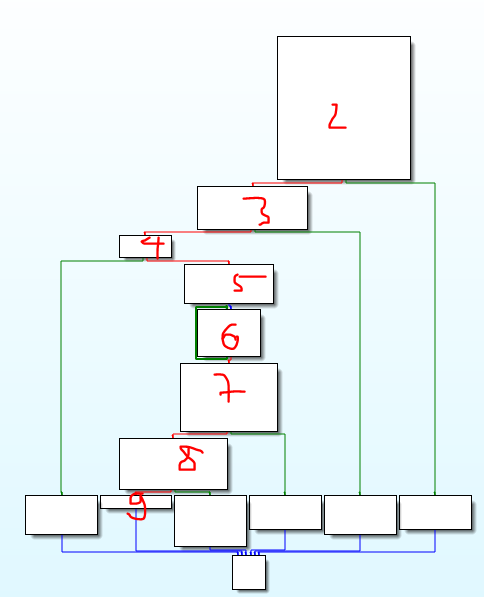
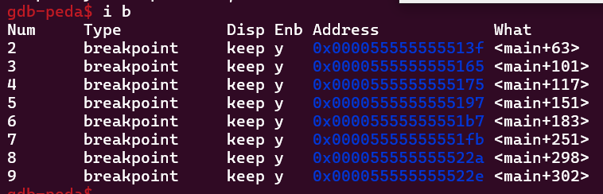
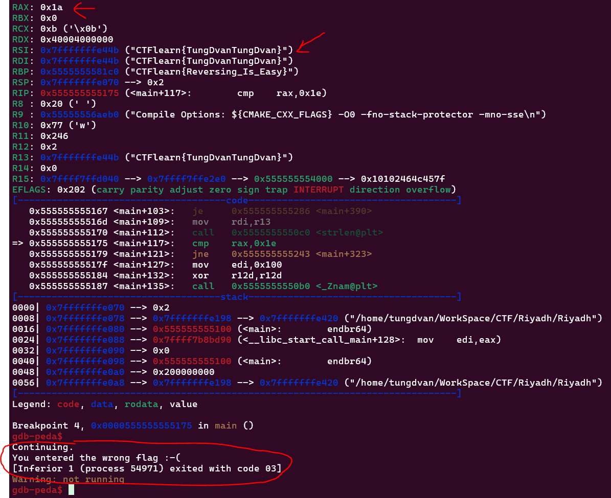
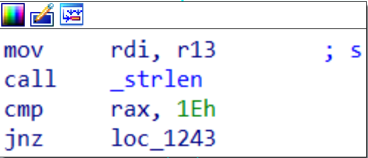

# CTF/RE

## [Riyadh](https://ctflearn.com/challenge/991)

## Lời giải:

- Về phần chạy chương trình, thử và ném vào IDA thì chúng ta làm như trong bài đầu tiên `1_Reykjavik`

- Dựa trên những gì chúng ta đã được biết ở bài một, khi chúng ta chưa biết có thể làm gì ở chương trình này thì tư duy đầu tiên của tui vẫn là truy ngược từ cuối lên, và sẽ được thứ tự như sau:
    
    
 

- Đặt break point cho từng khối với input thử là `TungDvanTungDvan`, ta được breakpoint như sau: 

    

- Ta chạy `r` từng lần một và ta thấy đến breakpoint thứ 4 chương trình đã thoát ra rùi

    

- Quay lại khối 4 xem nó có điều kiện gì khiến cho nó sai:

    

    - Vậy là khối này thực hiện kiểm tra chiều dài của chuỗi với một số là `1Eh` hay `30`, và nó đang so sánh `rax` với số đó -> rax sẽ lưu chiều dài của một cái gì đó, quay lại chương trình của mình và xem giá trị rax của mình đang lưu giá trị và cố gắng đoán xem nó đang là giá trị của cái gì, ta thấy rax lưu giá tị `1a` hay `26` và đó chính là chiều dãi của chuỗi input ta nhập vào `CTFlearn{TungDvanTungDvan}`, vậy ta sẽ cố gắng thay đổi chiều dài của input vào sao cho nó thoả mãn có chiều dài `30`

- Ta chạy với input mới, thực hiện câu lệnh `r CTFlearn{TungDvanTungDvanTung}` và xem tiếp tục chương trình đến khi nào thì dừng.

- Khi chạy tiếp thì ta lại thấy chương trình của ta dừng lại ở `break7`, nhưng ta thấy tại `break6` nó thực hiện lặp lại liên tục, bên cạnh đó có những điều thay đổi mà ta có thể nhận ra:
    
    - rax tăng dần từ `0` đến `0x1e`
    - thanh `rbp` lưu trữ một chuỗi rất giống `flag`
    - thanh `rsi` lưu trữ sau mỗi lần lặp là thứ tự lần lượt của chuỗi input chúng ta

    --> mạnh dạng đoán đây là so sánh từng kí tự trong chuỗi của chúng ta với một chuỗi trong thanh `rbp`

    --> Spam chuỗi đó vào xem sao

- Sau khi `r CTFlearn{Masmak_Fortress_1865}` thì ta thấy chương trình thì All done

    ```
    CTFlearn{Masmak_Fortress_1865}
    ```

- Cách làm hơi mò một chút nhưng đó là tất cả những gì tui nghĩ khi bắt đầu làm bài toán này