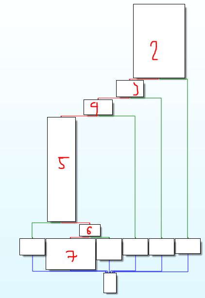
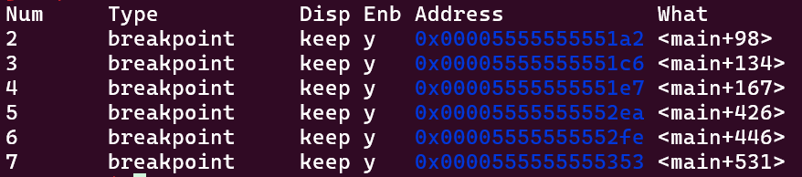
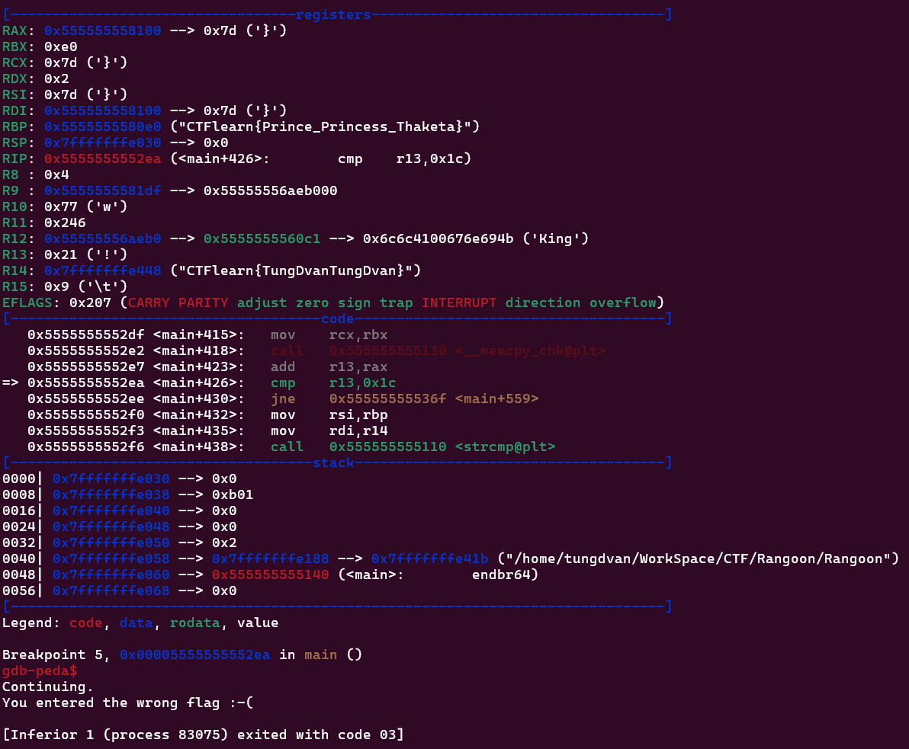
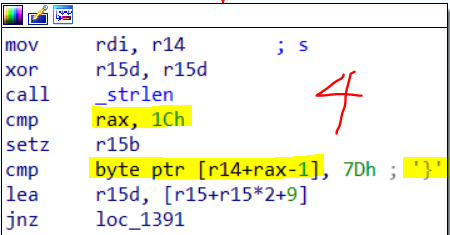
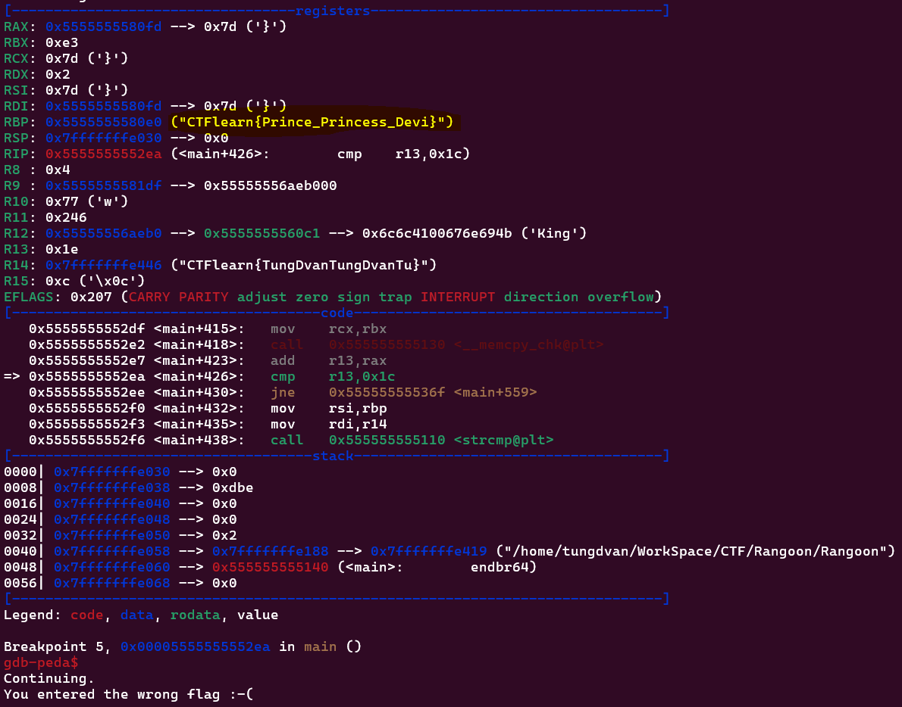
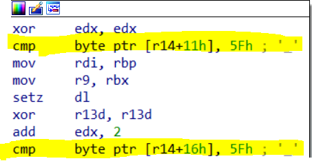
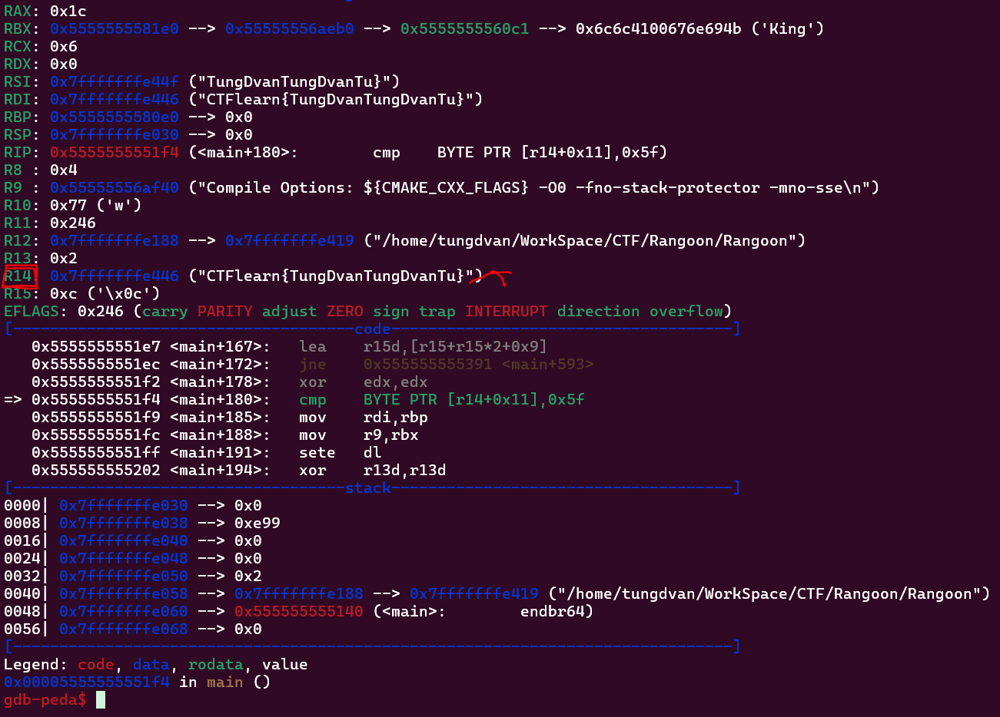
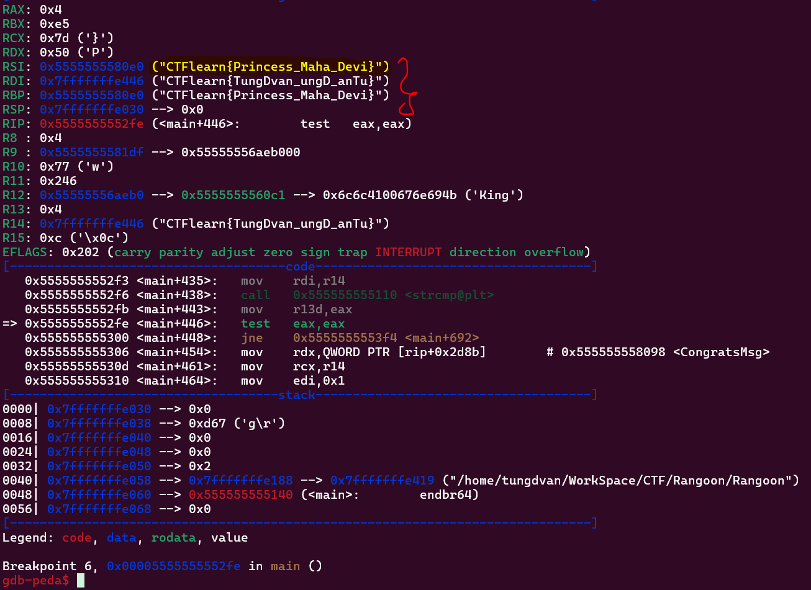

# CTF/RE

## [Rangoon](https://ctflearn.com/challenge/994)

## Lời giải:

- Thực hiện các thao tác như trong 2 bài trước để xem ý tưởng nó như thế nào, nếu không OK thì chúng ta cố gắng nghĩ đến các khác.

- Đặt break point theo thứ tự các khối sau:

    

    

- Ta thực hiện chạy thử với input `CTFlearn{TungDvanTungDvan}`, và thấy chương trình dừng lại ở break5

    

- Thoạt đầu nhìn qua ta thấy tự dưng trong thanh `rbp` có một chuỗi trông rất giống flag `CTFlearn{Prince_Princess_Thaketa}` và nhìn qua thì tui có suy nghĩ thì bài này có ý tưởng khá giống so với ý tưởng của bài 1, kiểu chạy đến một hàm nào đó và nó sẽ so sánh chuỗi của mình với một chuỗi có sẵn, nhưng mà chúng ta mà spam lun vào chuỗi đó vào thì khả năng nhầm là rất cao, bởi vì có 2 yếu tố:
    
    - Thứ nhất, đây chưa phải là khối cuối cùng để nhảy đến khối hiện All Done

    - Thứ hai, khi chúng ta đọc mã chương trình thì thấy khối này đang so sánh giá trị `r13` với `0x1c`, chứ không phải so sánh chuỗi

- Tóm cái váy lại thì thay vì ngồi suy luận thì cứ spam thẳng chuỗi đó vào xem ra sao, và quay lại đây để bàn tiếp, dĩ nhiên ý tưởng kia là fail nhá.

- Bây giờ chúng ta suy ngược từ dưới lên là có vấn đề ở khối 5, nhưng mà nhìn khối 5 trông tởm quá thôi thì thôi ta xem những khối bé bé xinh xinh trước đó xem mình có thoả mãn cái điều kiện gì của nó không.

- Bây giờ xem lại khối số 4:

    

- Trong khối này có 2 vấn đề cần nhìn ra:

    - Thứ nhất, khối này dùng để kiểm tra kí tự cuối cùng trong chuỗi của mình có kí tự `}` hay không, nếu không có thì nó sẽ kết thúc chương trình, có thể test thử với 2 test là `CTFlearn{TungDvan}` và `CTFlearn{TungDvan` thì ta thấy `test1` nó dừng ở `break5` còn `test2` nó dừng ở `break4`

    - Với suy luận ở trên thì ta thấy có một sự mâu thuẫn trong khối này là cái dòng `cmp rax, 1Ch` để làm gì `?????` bởi vì câu lệnh `cmp byte ptr [r14+rax-1], 7Dh ; '}'` là đã dùng để so sanh kí tự cuối rùi, vì auto `rax` lưu chiều dài chuỗi, không cần câu lệnh `cmp rax, 1Ch` thì khối lệnh này vẫn được thực thi, vậy dòng này nó ý đồ gì --> suy ra khả năng cao chiều dài của chuỗi là `1Ch` hay `28`.

        --> Thử luôn với một test khác thoả mãn có 28 kí tự `CTFlearn{TungDvanTungDvanTu}`

        --> Chương trình vẫn dừng lại ở break5 nhưng có một điều khác so với test đầu tiên đó chính là `rbp` lại lưu một chuỗi khác so với test đầu đó là `CTFlearn{Prince_Princess_Devi}` --> Chắc đang đi đúng hướng (bởi vì toàn bộ những test khác mà không phải 28 kí tự thì nó đều hiện chuỗi `CTFlearn{Prince_Princess_Thaketa}`)

        

- Bây giờ ta sẽ quay lại break5 để xem và cố gắng thay đổi `input` để nó có thể đưa ra `flag`

- Nhìn những dòng đầu tiên trong break5 ta thấy: 

    

    

    - Ta nhìn 2 dòng hightlight và thanh `r14` bên dưới thì thanh `r14` đang lưu chuỗi input của ta, mà nó thực hiện đang so sánh kí tự byte thứ `11h` hay `17` với kí tự `_`, và `16h` hay `22` với kí tự `_`. Ta cố tình thay đổi input sao cho nó thoả mãn điều kiện trên lun, ta thử test `CTFlearn{TungDvan_ungD_anTu}` và thấy chương trình lại hiện một chuỗi khác 

    

    --> Nghi nghi là chương trình sẽ thực hiện so sánh một số đặc điểm của chuỗi đó rùi dựa vào giá trị so sánh đó rùi mới so sánh chuỗi chính và chuỗi phụ --> `CTFlearn{Princess_Maha_Devi}` là flag

    ```
    CTFlearn{Princess_Maha_Devi}
    ```