# CTF/RE

## [Recklinghausen](https://ctflearn.com/challenge/995)

## Lời giải:

- Với tư duy từ bài 1, 2, 3 ở trên thì đến với bài này chúng ta **không** thể đoán trước được ngay khối nào sẽ là khối cuối cùng để muốn nhảy đến nhưng chúng ta sẽ loại được ngay một số khối:

    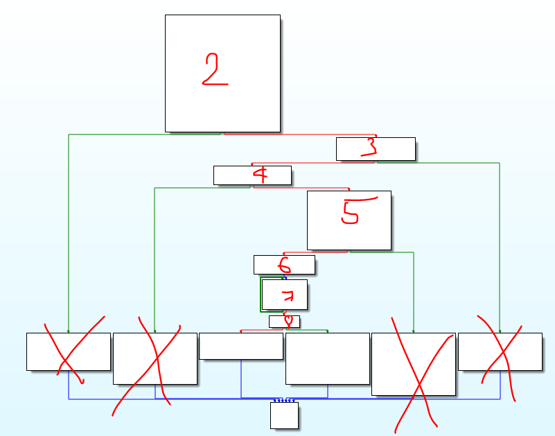

- Ta thực hiện đặt break point trước đi, sau đó rùi tính tiếp. (intput `CTFlearn{TungDvan}`, `59`, `81`, `99`, `164`, `184`, `201`, `206`)

    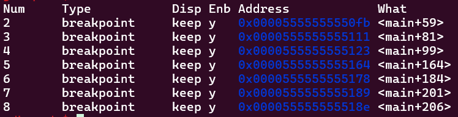

- Khi ta chạy thì bị dừng lại ở `break3` và nó hiện ra một dòng thật là chua chát `You are too slow in the debugger bro!` nôm na là `Quá chậm` (dòng này chỉ hiện khi bạn nhấn một cách từ từ, kiểu 1s sau khi thực hiện lệnh `continue` để nhảy đến break point tiếp theo), còn nếu bạn nhấn nhanh và liên tục thì nó sẽ dùng lại ở `break4` chứ không phải `break3`, 2 hình ảnh sau là sự so sánh:

    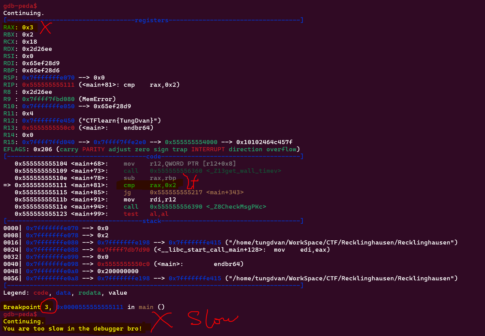

    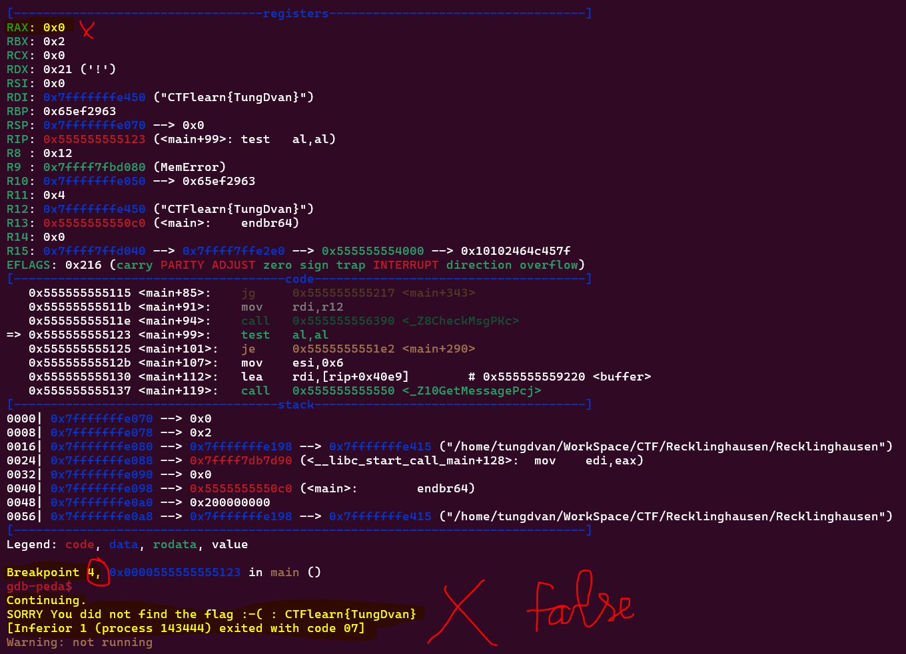

- Vậy điều gì ở `break3` khiến cho chúng ta xuất hiện dòng chữ mà rất là kì lạ như thế kia, đi vào `break3` và xem xét (nó là một AntiDebug):

    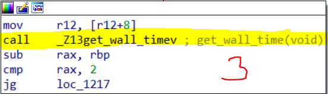

    - Trong `break3` bé bé xinh xinh nó có gọi một hàm chắc có nhiệm vụ là `get_wall_time`, click vào xem nhiệm vụ của hàm đó là gì

        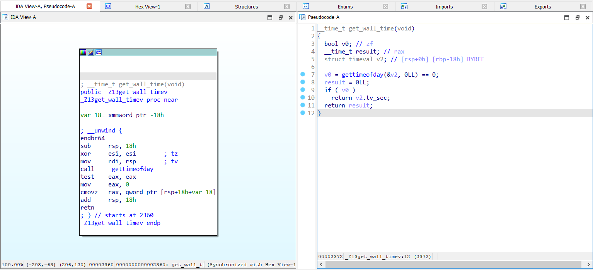

        - Nhấn `F5` để xem mã giả của nó (bên phải), thì chúng ta thấy bên trong hàm đó lại có một lệnh `_gettimeofday`

        ```C
        #include <stdbool.h>
        #include <sys/time.h>

        __time_t get_current_time() {
            bool v0;                 // Biến kiểu boolean, giả sử là zero flag (zf)
            __time_t result;         // Biến lưu giá trị thời gian, giả sử là thanh ghi rax
            struct timeval v2;        // Cấu trúc timeval để lưu thời gian, được đặt trên ngăn xếp

            // Gọi hàm gettimeofday để lấy thời gian hiện tại, kết quả được lưu vào cấu trúc timeval v2
            v0 = gettimeofday(&v2, 0LL) == 0;

            result = 0LL;            // Khởi tạo giá trị result là 0

            // Kiểm tra xem việc lấy thời gian có thành công không (zero flag v0 được thiết lập)
            if (v0)
                return v2.tv_sec;    // Nếu có, trả về giây từ cấu trúc timeval v2
            else
                return result;       // Nếu không, trả về giá trị result (0)
        }
        ```

        - Như vậy đây sẽ là một chức năng để để tính toán thời gian khi mình debug, nếu mà máy chạy thì thời gian sẽ lần lượt và như nhau, nhưng khi chúng ta debug bằng tay nhảy từng câu lệnh `ni` hay `step` thì nó sẽ tính thời gian và độ lệch nó quá lớn sẽ khiến cho chương trình biết chúng ta đang debug.

    - Bạn có thể kiểm tra trong `break2` thì thấy có có một hàm gọi để lấy giá trị thời gian ở `break2` rùi trả giá trị vào thanh `eax` xong lưu lại vào thanh `rbp`:

        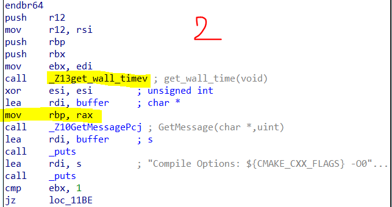 

        - Trong `break3` cũng gọi hàm đó và thực hiện so sánh giá trị trả về ở thời điểm đó so với thời điểm `break2` (lưu ý là mỗi lần gọi hàm `get_wall_time` thì nó sẽ trả giá trị trong thanh `eax`)

            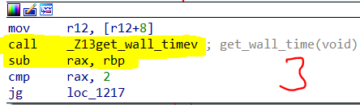

            - Hiểu đơn giản là `time`(break3) - `time`(break3) > 2 --> Bạn đang debug 

    - Cách khắc phục là đọc chương trình xem nó có gọi hàm gettimeofday không, nếu có thì đến khối đó nhấn nhanh để lừa máy tính, hoặc thực hiện đặt break point ở chỗ mình cần sau khối check_time và thực hiện nhảy một phát đến chỗ đó lun (hiện tại mình chỉ biết mỗi debug tĩnh nên nó có vẻ hơi thủ công)

- Vậy chúng ta đã biết là vấn đề thực sự của chúng ta là ở `break4` chứ ko phải `break3`:

    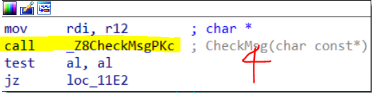

    - Trong IDA chúng ta chỉ việc click vào hàm đó là sẽ hiện ra các mã máy trong khối đó và xem xem chức năng của khối đó là gì:

        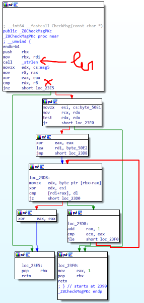

        - Đọc ta có thể thấy là dường như nó đang lấy chiều dài của chuỗi chúng ta (giá trị trong thanh `eax` rùi lưu vào thanh `r8`) xong so sánh với giá trị trong thanh `rdx` --> đến lúc này xem thông số trong thanh `rdx` là gì để chúng ta cố gắng thay đổi chiều dài chuỗi sao cho nó bằng đúng giá trị trong thanh `rdx` --> Quay lại `gdb-peda`
        
            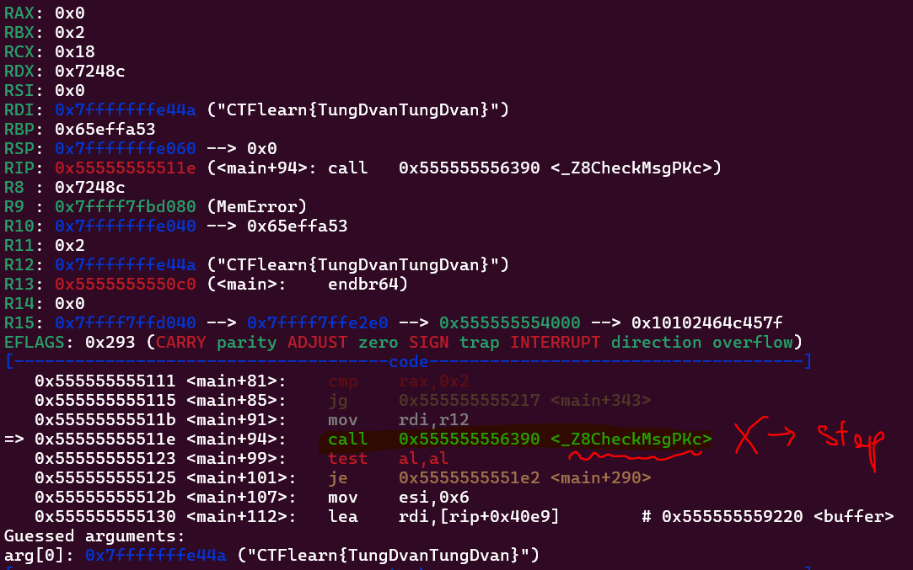

        - Khi đến câu lệnh gọi hàm này thì nếu chúng ta gõ `ni` thì nó sẽ nhảy trực tiếp đến lệnh bên dưới là `test al, al`, muốn đi từng lệnh trong hàm đó thì ta dùng câu lệnh `step` thay vì `ni`, sau đó ta nhảy đến khối lệnh `cmp rdx, r8` để xem xem giá trị của `rdx` là gì:

            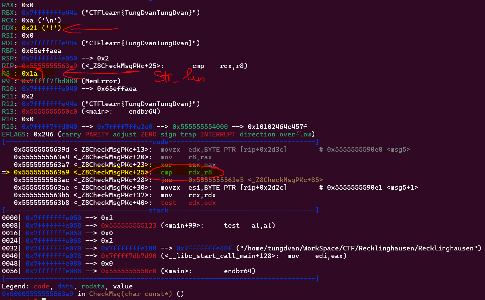

            --> Chiều dài của chuỗi là `0x21` hay `33` --> Đổi input là: `CTFlearn{TungDvanTungDvanTungDva}` --> chạy vẫn chỉ dừng lại ở `break4` --> Vẫn cần quan tâm hàm `_Z8CheckMsgPKc`

    - Chúng ta kết hợp nhìn mã máy trong IDA và những thông tin lưu trữ trong gdb-pega để đoán xem khối chương trình này đang làm những cái gì:

        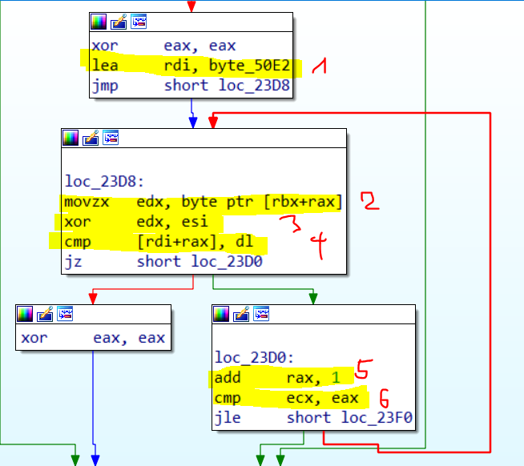

        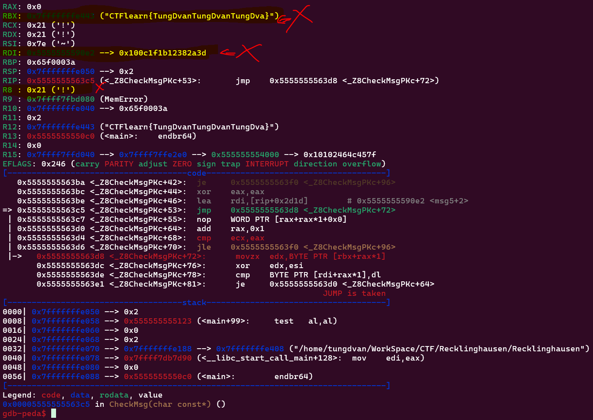

        - Ta đọc qua thì thấy ban đầu nó làm sạch thanh `eax` (eax = 0), chuyển cái `byte_50E2` và `rdi`, tiếp đến nó lấy cái byte thứ `eax` của thanh `rbx` ra gán vào `edx` (mà thanh `rbx` của chúng ta đang lưu chuỗi input), rùi `xor` giá trị byte vừa lấy với `esi`, xong kiểm tra cái kết quả vừa xor đó với một giá trị thứ `eax` trong thanh `rdi` ra kiểm tra, nếu nó giống nhau thì tăng `eax` lên 1 đơn vị rùi tiếp tục lặp lại bác bước đó --> Giống mùi đang so sánh từng byte một của input với một thứ gì đó --> Nghi ngờ thanh `rdi` đang lưu flag nhưng đã bị mã hoá

        - Bây giờ chúng ta sẽ lôi hết những giá trị được lưu trong thanh `rdi` (nghi ngờ chứa flag) ra rùi tính tiếp, bằng cách click vào `byte_50E2`

            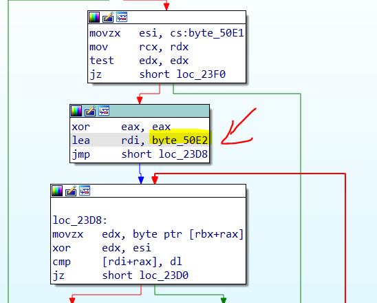

            Rùi nhấn `Shift + E` để hiện ra bảng bên phải để lấy dữ liệu trong `byte_50E2`

            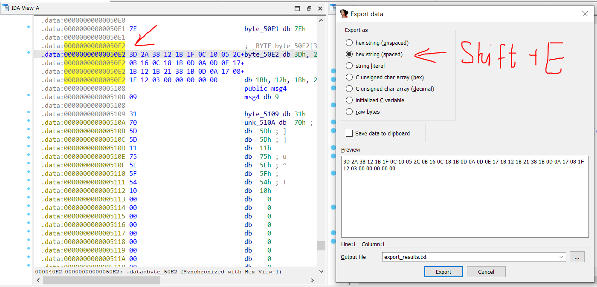

            - Vậy chúng ta có một chuỗi dữ liệu là `3D 2A 38 12 1B 1F 0C 10 05 2C 0B 16 0C 18 1B 0D 0A 0D 0E 17 1B 12 1B 21 38 1B 0D 0A 17 08 1F 12 03 00 00 00 00 00`, quay lại thì ta thấy chương trình của chúng ta sẽ lấy từng byte một của input rùi xor với `esi`, xong kiểm tra nó với những dữ liệu trên, vậy chúng ta chỉ cần làm ngược lại là từ những dữ liệu trên chúng ta xor với esi thì nó sẽ **maybe** ra flag (đến đoạn này tui chưa chắc nha nhưng cứ thử đê). 

            - Muốn biết trong thanh `esi` có thứ gì thì quay lại `gdb-peda` nhảy đến  lệnh `xor edx, esi`, rùi gõ `info register esi` để xem trong `esi` có gì:

                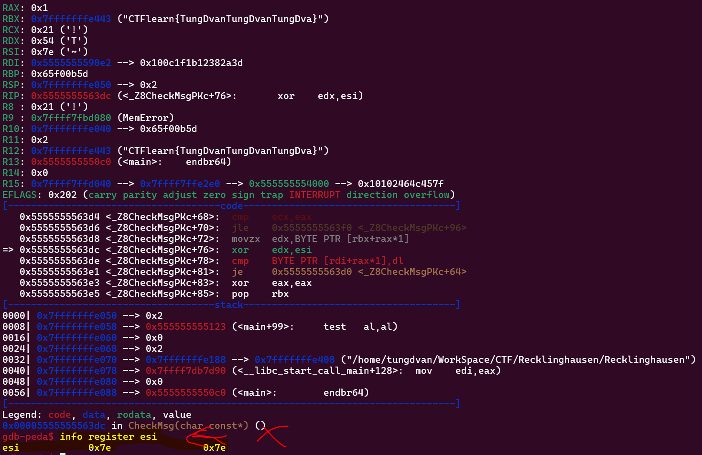

            - Như vậy ta biết được thứ mà xor là giá trị `0x7e`, vậy ta viết một chương trình xor tất cả những dữ liệu trên với `0x7e` để nó ra cái chuỗi kí tự ban đầu:

    - Code C của tui viết để làm ngược lại: (input: 3D 2A 38 12 1B 1F 0C 10 05 2C 0B 16 0C 18 1B 0D 0A 0D 0E 17 1B 12 1B 21 38 1B 0D 0A 17 08 1F 12 03 00 00 00 00 00)

        ```C
        #include<stdio.h>

        int main(){
            while (1){
                int x;
                scanf("%x", &x);
                printf("%c", x ^ 0x7e);
            }
        }
        ```

        - Ta sẽ có đầu ra là như sau: `CTFlearn{Ruhrfestspiele_Festival}~~~~~` --> flag
    
```
CTFlearn{Ruhrfestspiele_Festival}
```
