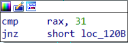

# CTF/RE

## [Ramada](https://ctflearn.com/challenge/1009)

## Lời giải:

- Đầu tiên đặt breakpoint với input đầu vào `CTFlearn{TungDvan}`

    

    - 97, 139, 156, 163, 237, 322

        

- Chương trình dừng lại ở `break5`, xem `break5` ta thấy:

    

    - So sánh `rax` với `31`, ta quay lại `break4` ta thấy:

        

        - `break4` là một hàm strlen để lấy chiều dài của chuỗi và so sánh kí tự cuối cùng của chuỗi với `}`, như vậy rax trong `break5` là chiều dài của input đầu vào --> thay đổi input để thoả mãn `31` kí tự

            --> Input mới: `CTFlearn{TungDvanTungDvanTungD}`

- Với input mới thì chương trình dừng lại ở `break5`, ta quan tâm trong break5 có cái gì và ta có thể thấy một lệnh `call` khác gióng dùng để check flag: 

    

    - Khi click vào `_Z9CheckFlagPKc` thì ta thấy hiện một hàm kiểm tra từng kí tự một rất giống với bài thứ 4 trước đó: 

        

    - Cũng với tư tưởng ban đầu làm sạch thanh `eax` (với mục đích để làm biến đánh dấu thứ tự từng kí tự một), chuyển `data` vào thanh `rsi`, lấy `byte` thứ `rax` của thanh `rdi` (nghi nghi đây là thanh chứa input), chuyển giá trị `hex` của kí tự đó vào thanh `edx`, thực hiện nhân `edx` với giá trị hex 2 lần (kết thúc là thanh `edx` = `ecx` ^ 3), rùi thực hiện so sánh `edx` với giá trị thứ rax trong thanh `rsi` (đây là dword nên có 4 (byte) * rax), xong tăng rax lên 1 đơn vị, kiểm tra nó với số `0x15` (hay `21`) (ta thấy chuỗi phải có chiều dài là `31` thì chắc `21` kí tự này là flag còn 10 kí tự kia là `CTFlearn{}`)

    - Nhưng trong bài này chúng ta không thể lấy trực tiếp dữ liệu trong `data`

        

        nên chúng ta sẽ lấy dữ liệu trong việc debug trên `gdb-peda`

    - Do dữ liệu được cho vào thanh `rsi` 
    
        

    nên khi chúng ta debug đến đoạn đó chúng ta sẽ trích lun dữ liệu trong thanh `rsi` ra, do chúng ta đã biết được trước là có `21` giá trị nên ta sẽ trích `21` giá trị dạng `dword` ra bằng câu lệnh `x/21w $rsi`

    

- Như vậy toàn bộ giá trị kia sẽ là những kí tự của flag^3 và bây giờ chúng ta cần phải làm ngược lại thao tác đó:

    ```txt
    0x00013693      
    0x0006b2c0      
    0x0011a9f9      
    0x00157000
    0x0001cb91      
    0x001bb528      
    0x001bb528      
    0x000ded21
    0x00144f38      
    0x000fb89d      
    0x00169b48      
    0x000d151f
    0x0008b98b      
    0x0017d140      
    0x000ded21      
    0x001338c0
    0x001338c0      
    0x0011a9f9      
    0x0001b000      
    0x00144f38
    0x001734eb
    ```


    ```C
    #include<stdio.h>
    #include<math.h>

    int main(){
        while (1){
            long long n;
            scanf("%x", &n);
            printf("%c", (int)cbrt(n));
        }
    }
    ```

    - Ta sẽ được output như sau : `+Lip1zzaner_Stalli0ns`

    ```
    +Lip1zzaner_Stalli0ns
    ```