# CTF/RE

## [Raspberry](https://ctflearn.com/challenge/1080)

## Lời giải

- Với bài này khi chúng ta bắt đầu ném vào IDA thấy một ảnh trước màn hình (mắc mệt):

    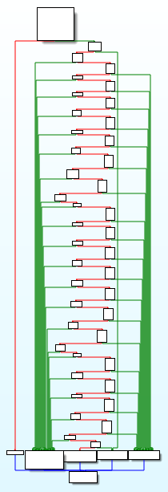


- Nếu bài này chúng ta suy luận như mấy bìa trước thì đúng thật là việc đặt `break_point` trong rất là không khả thi, xong hình như chúng ta còn không thể `disas` chương trình nữa:

    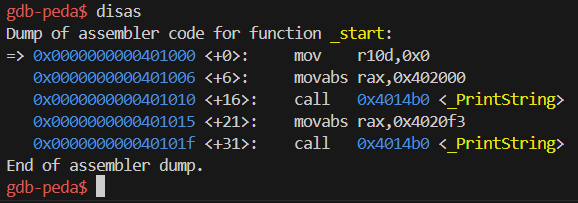

- xong bên cạnh đó chúng ta nhận ra một điều đó là có 2 khối mà lượng mũi tên màu xanh lá cây nhảy vào nhiều nhất:

    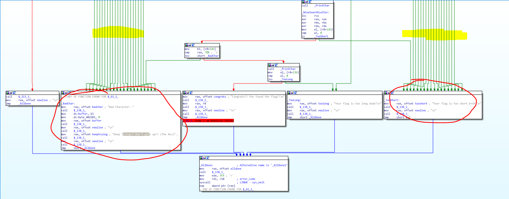

- Và ở mỗi bước kiếm tra chúng ta đều thấy nó kiểm tra đều có thể nhảy vào 2 khối này (tức là mỗi điều kiện kiểm tra khác nhau thì sai một phát là nhảy vào lun)--> chúng ta sẽ phải check thủ công từng khối một (số câu lệnh từng khối cũng ít nên chắc là sẽ khả thi)

    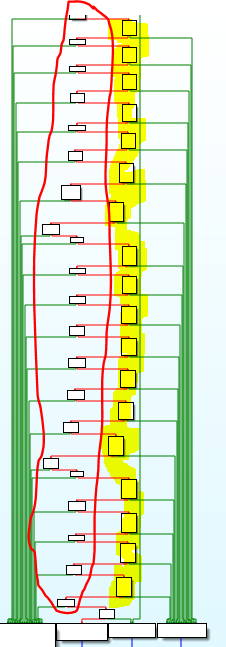

- Đọc lướt qua một lượt thì hầu như các khối được tô vàng chỉ có mục đích là lấy kí tự thứ i còn khối màu đỏ thì là các khối để so sánh. Ta sẽ ngồi phân tích một vài khối đầu tiên:

    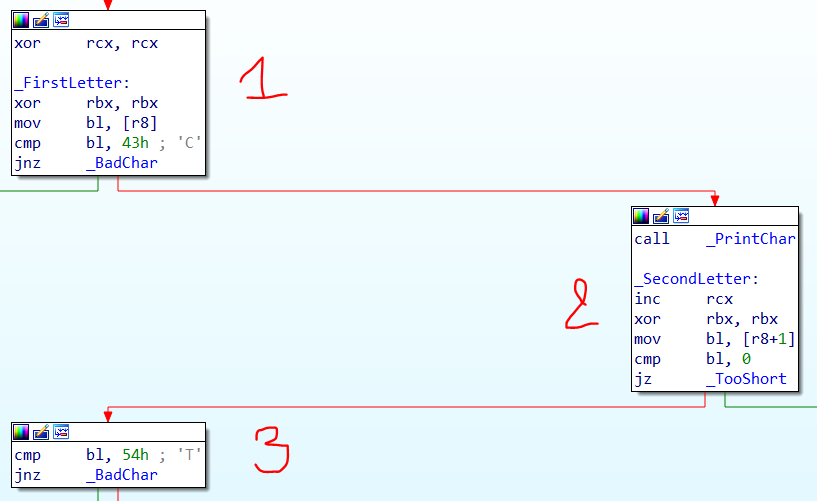

    - Khối 1 ta thấy chương trình sẽ làm sạch thanh rbx, chuyển byte đầu tiên trong thanh `r8` vào bl, rùi so sánh với `0x43` hay kí tự `C`.

    - Khối 2 ta thấy rcx lên 1 đơn vị (tui vẫn chưa thấy nó tăng lên để làm gì), rùi lại làm sạch thanh `rbx`, rùi lại chuyển byte thứ 2 trong thanh `r8` vào `bl`, rùi so sánh với `0x54` hay `T`

    - Và dường như tất cả các khối tô vàng chỉ để lấy byte thứ i của thanh `r8`

- Vậy bây giờ ta sẽ xử lý từng khối một (với bl chứa kí tự thứ i)

    - Kí tự 1:
    
        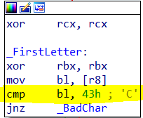

        - Nó là so sánh kí tự `0x43` nên là `C`

    - Kí tự 2:

        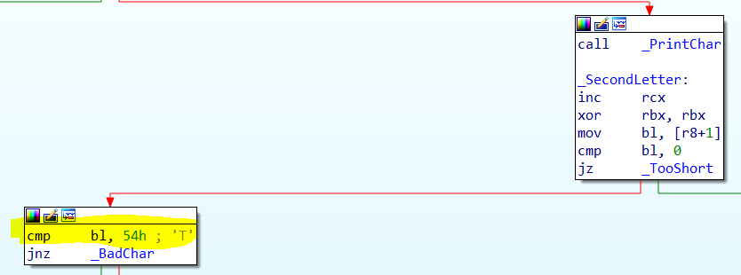

        - Nó là so sánh kí tự `0x54` nên là `T`

    - Kí tự 3:

        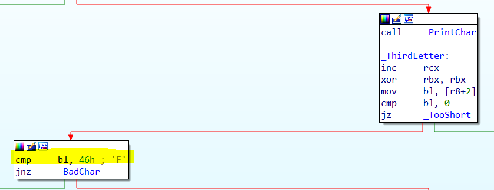

        - Nó là so sánh kí tự `0x46` nên là `F`

    - Kí tự 4:

        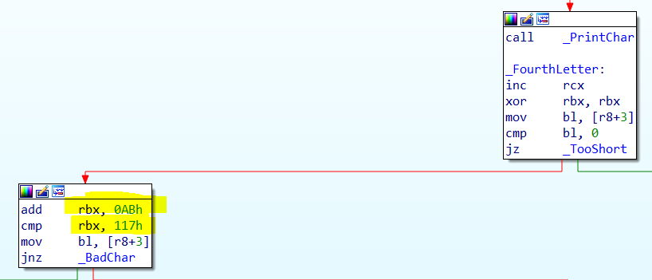

        - Lấy kí tự đó cộng với `0xab` (hay `171`) rùi so sánh với `0x117` (hay `279`), nên kí tự đúng sẽ là lấy `0x117` - `0xab` = `0x6c` (hay `108` hay `l`) nên là `l`

    - Kí tự 5: 

        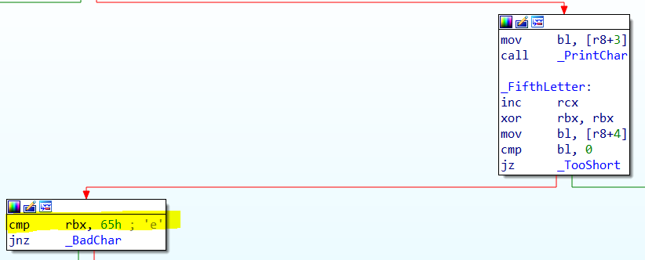

        - Nó là so sánh kí tự `0x65` nên là `e`

    - Kí tự 6:

        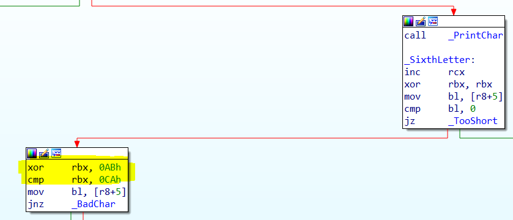

        - Lấy kí tự đó xor với `0xab` rùi so sánh với `0xca` nên kết quả sẽ là lấy `0xca` xor `0xab` = `0x61` (hay `97` hay `a`) nên là `a`

    - Kí tự thứ 7:

        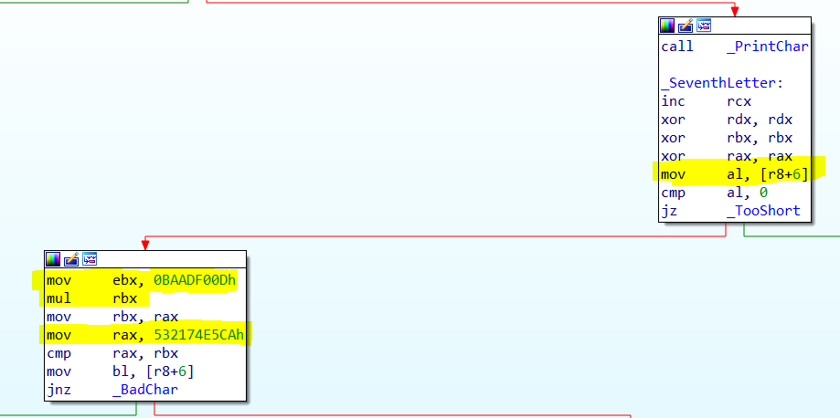

        - Chuyển kí tự đó vào thanh al, xong nhân với giá trị `0xbaadf00d` rùi thực hiện so sánh với `0x532174e5ca`, nên kết quả sẽ lấy `0x532174e5ca` chia cho `0xbaadf00d` = `0x72` (hay `114` hay `r`) nên là `r`

    - Kí tự thứ 8:

        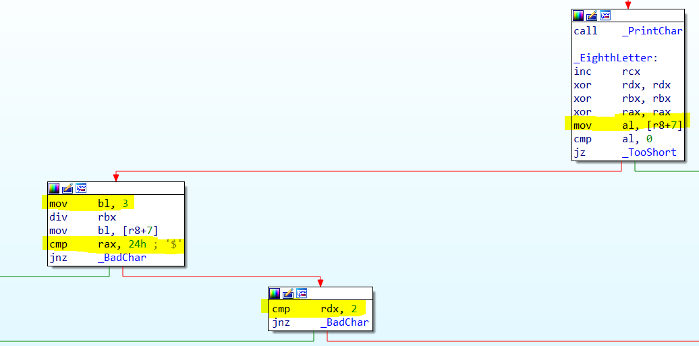

        - Chuyển kí tự đó vào thanh `al`, lấy số đó chia cho 3, thương sẽ được lưu ở `rax` (so sánh với `0x24` hay `36`), còn số dư sẽ được lưu ở `rdx` (so sánh với số `0x2`) nên đưa về bài toán tìm một số chia cho 3 được 36 và dư 2 --> Số cần tìm là 36 * 3 + 2 = `110` hay `n` --> nên là `n`

    - Kí tự thứ 9:

        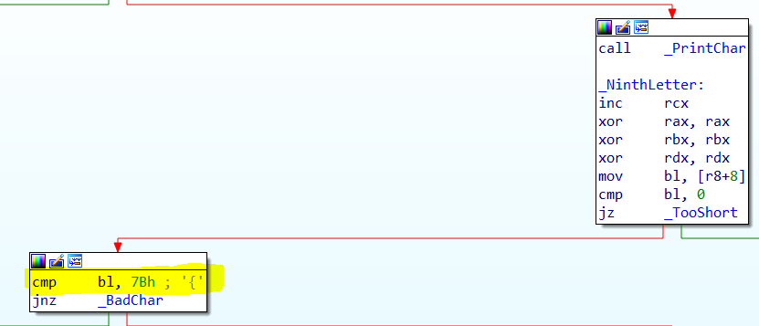

        - Nó là so sánh kí tự `0x7b` nên là `{`

    - Kí tự thứ 10:

        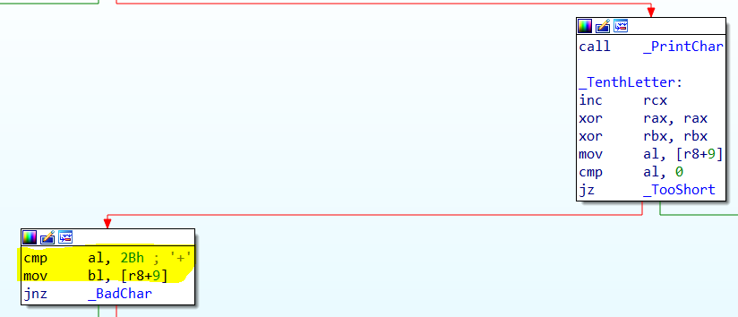

        - Nó là so sánh kí tự `0x2b` nên là `+`

    - Kí tự thứ 11:

        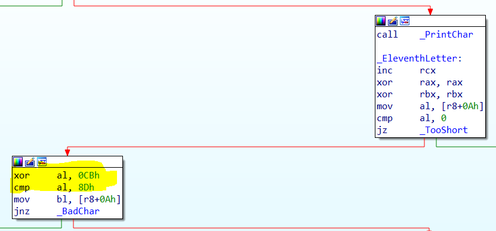

        - Lấy kí tự xor với `0xcb` rùi so sánh với `0x8d` nên kết quả là `0x8d` xor `0xcb` = `0x46` hay `F` nên là `F`

    - Kí tự thứ 12:

        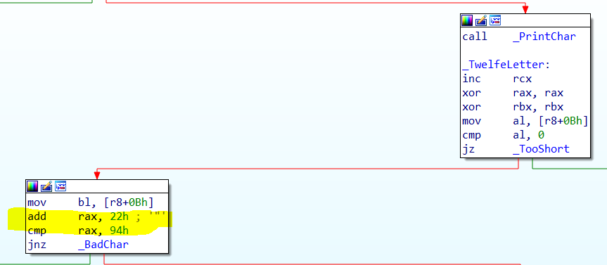

        - Lấy kí tự cộng với `0x22` rùi so sánh với `0x94` nên kết quả là `0x94` trừ `0x22` = `0x72` hay `r` nên là `r`

    - Kí tự thứ 13:

        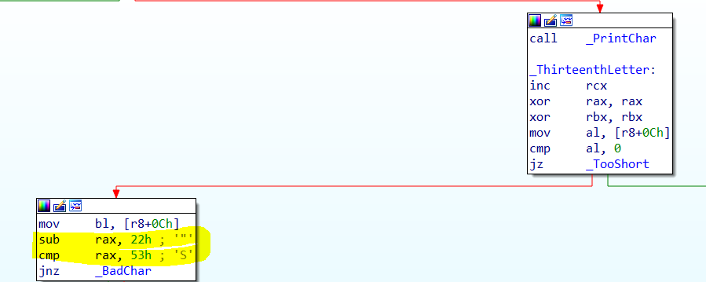

        - Lấy kí tự đó trừ đi `0x22` rùi so sánh với `0x53` nên kết quả là `0x53` cộng `0x22` = `0x75` hay `u` nên là `u`

    - Kí tự thứ 14:

        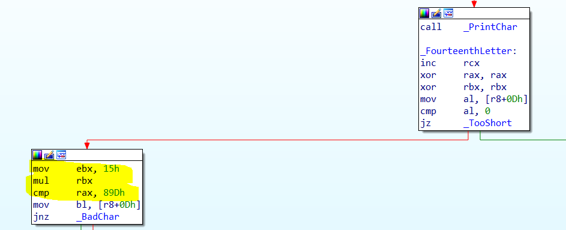

        - Lấy kí tự đó nhân với 0x15 rùi so sánh với 0x89d nên kết quả là `0x89d` chia `0x15` = `0x69` hay `i` nên là `i`

    - Kí tự thứ 15:

        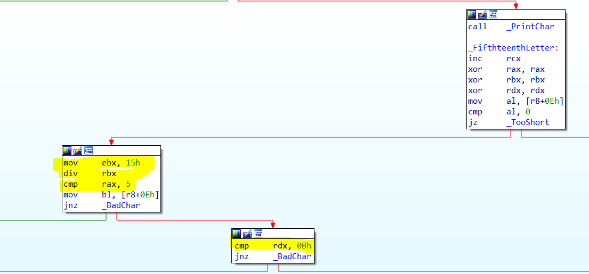

        - Lấy kí tự đó chia cho `0x15` hay `21`, thương so sánh với `5` còn số dư so sánh với `0xb` hay `11` nên kết quả là 5 * 21 + 11 = `116` hay `t` nên là `t`

    - Kí tự thứ 16: 
    
        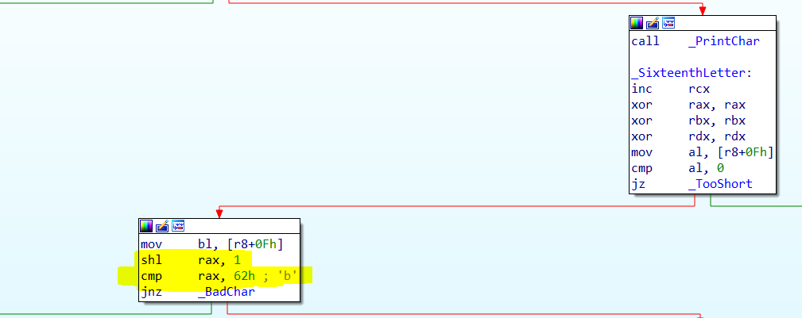

        - Dịch kí tự đó 1 bit sang trái rùi so sánh với 0x62 hay `0110 0010` nên ta cần dịch lại 1 bit sang phải nên là `00110 001` hay `1` nên là `1`

    - Kí tự thứ 17:

        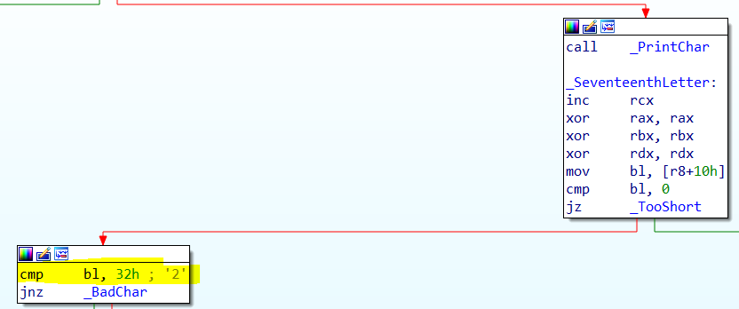

        - Nó là so sánh kí tự `0x32` nên là `2`

    - Kí tự thứ 18:

        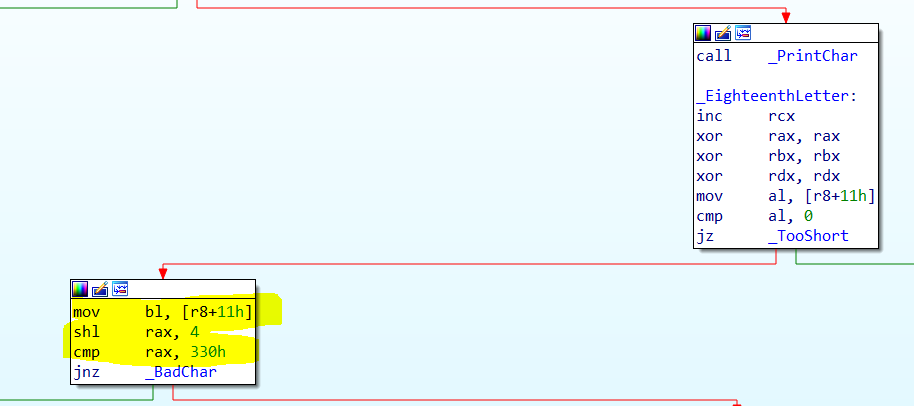

        - Dịch kí tự đó 4 bit sang trái rùi so sánh với `0x330` hay `11 0011 0000` nên ta cần dịch lại 1 bit sang phải nên là `00 0011 0011` hay `3` nên là `3`

    - Kí tự thứ 19: 

        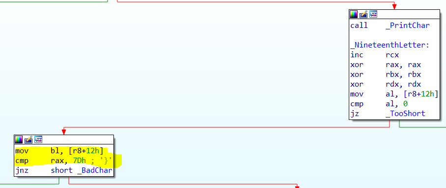

        - Nó là so sánh kí tự `0x7d` nên là `}`


- Tóm lại 19 kí tự thì ta sẽ được flag :

    ```
    CTFlearn{+Fruit123}
    ```

